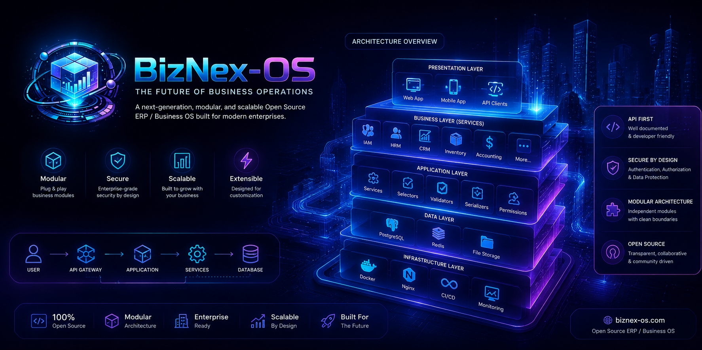

# 🧠 BizNex OS — System Architecture (Clean Production Design)
---

---
## 🏗️ 1. High-Level Architecture

```text
                ┌────────────────────────────┐
                │   Client Applications      │
                │ (Web / Mobile / POS)       │
                └────────────┬───────────────┘
                             │
                             ▼
                ┌────────────────────────────┐
                │   Django REST API Layer    │
                │  (Authentication + Routes) │
                └────────────┬───────────────┘
                             │
                             ▼
                ┌────────────────────────────┐
                │     Service Layer          │
                │ (Business Logic Engine)    │
                └────────────┬───────────────┘
                             │
        ┌────────────────────┼────────────────────┐
        ▼                    ▼                    ▼
┌──────────────┐   ┌────────────────┐   ┌────────────────┐
│ Inventory    │   │ Accounting     │   │ Sales / Orders │
│ Domain       │   │ Domain         │   │ Domain         │
└──────────────┘   └────────────────┘   └────────────────┘
        │                    │                    │
        └────────────────────┼────────────────────┘
                             ▼
                ┌────────────────────────────┐
                │   Domain Event Layer       │
                │ (Ledger + Audit System)    │
                └────────────┬───────────────┘
                             ▼
                ┌────────────────────────────┐
                │     PostgreSQL DB          │
                │ (Multi-Tenant Storage)     │
                └────────────────────────────┘
```

---

# 🧩 2. Core Design Principles

## 🏢 Multi-Tenant Isolation

* Every request is scoped by `organization_id`
* No cross-tenant data access
* Tenant resolved at middleware level

---

## 🧠 Service Layer Architecture

Business logic is NEVER in views/models.

```text
views → serializers → services → repositories → models
```

### Example:

* `InventoryService`
* `SalesService`
* `AccountingService`
* `ProcurementService`

---

## 📦 Domain-Driven Modules

Each module is independent:

```text
apps/
 ├── iam/            (auth, roles, permissions)
 ├── organization/   (tenant management)
 ├── inventory/
 ├── sales/
 ├── procurement/
 ├── accounting/
 ├── party/
 ├── reporting/
```

---

# 🧾 3. Accounting Architecture (Core Brain)

## 💰 Double Entry System

```text
Business Event
      ↓
Service Layer
      ↓
Journal Entry Created
      ↓
Debit = Credit enforced
      ↓
Stored in Ledger Tables
```

### Rules:

* No direct balance update
* Everything is journal-based
* Fully auditable trail

---

# 📦 4. Inventory Architecture (Ledger-Based)

```text
Stock In / Out Event
        ↓
Inventory Service
        ↓
Stock Movement Ledger
        ↓
Current Stock = SUM(movements)
```

### Features:

* No direct stock mutation
* Batch tracking
* Warehouse tracking
* Transfer support

---

# 🏢 5. Multi-Tenant Architecture

## Strategy: Shared DB + Tenant Isolation

```text
Organization Table
      ↓
All domain tables include:
- organization_id
```

### Middleware Flow:

```text
Request → JWT → Extract User → Resolve Organization → Inject tenant context
```

---

# 🔐 6. Authentication & Security

* JWT (SimpleJWT)
* Role-Based Access Control (RBAC)
* Permission-level access
* Audit logs for every action

---

# 📊 7. Reporting Architecture

```text
Domain Data
     ↓
Aggregation Layer (Service)
     ↓
Report Engine
     ↓
API Response (Fast Queries)
```

Reports:

* Profit & Loss
* Balance Sheet
* Inventory valuation
* Sales analytics

---

# 📡 8. Event & Audit System

```text
Any Business Action
        ↓
Event Logger
        ↓
Audit Table
        ↓
Immutable History Store
```

Tracks:

* who did what
* when
* before/after values

---

# 📦 9. Deployment Architecture (Docker)

```text
Nginx (optional)
      ↓
Gunicorn
      ↓
Django App (API)
      ↓
PostgreSQL
```

Optional scaling:

* Redis (cache / queues)
* Celery (async tasks)

---

# 🔄 10. Future Scaling Path

This architecture is designed to evolve into:

### Phase 1:

* Modular Monolith (current)

### Phase 2:

* Event-driven system (Celery + Redis)

### Phase 3:

* Microservices split:

  * Accounting service
  * Inventory service
  * Auth service

---

# 🧠 Summary

BizNex OS is built as:

> A modular, multi-tenant ERP backend system with strict separation of business domains, ledger-based financial integrity, and scalable Django service-layer architecture.

# 🧭 Deployment Status
The system is currently deployed and accessible:

Swagger UI: https://anik-biznex-os.onrender.com/api/docs/
ReDoc: https://anik-biznex-os.onrender.com/api/redoc/
